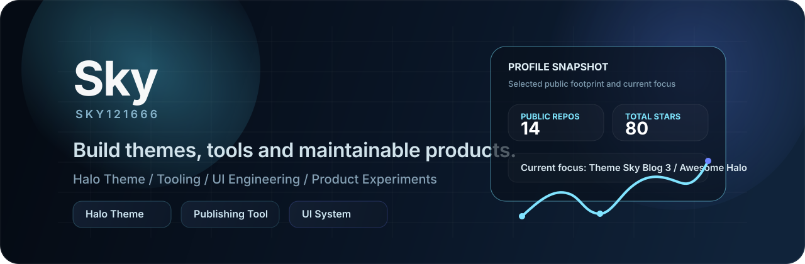

  

<h1 align="center">Sky / sky121666</h1>

  做 Halo 主题、内容发布工具，也做一些会长期维护的小产品。

  <a href="https://5ee.net">Blog</a>
  ·
  <a href="https://github.com/sky121666">GitHub</a>
  ·
  <a href="https://github.com/sky121666/awesome-halo">Awesome Halo</a>

## About Me

- 台州学院学生，偏爱把内容系统做得更顺手、更好看。
- 主要在做 Halo 主题、博客体验和内容发布相关工具。
- 最近在打磨桌面化 UI、主题配置体系，以及更完整的工程化细节。
- 喜欢长期维护项目，而不是只做一次性的 demo。

## What I Build

- **Halo Themes**: 从信息架构、交互到配置体系，持续打磨可长期维护的博客主题。
- **Publishing Tools**: 让内容从笔记到发布的链路更顺手、更稳定。
- **Small Products**: 面向自己长期使用的工具型产品，例如记账、管理和自动化脚本。

## Tech Stack

  

## Featured Projects

### [halo-theme-sky-blog-1](https://github.com/sky121666/halo-theme-sky-blog-1)

- **定位**：一套基于现代前端技术栈构建的 Halo 博客主题。
- **我负责**：主题架构、交互设计、插件适配、文档与持续迭代。
- **Tech**：`Halo` `Thymeleaf` `Alpine.js` `Tailwind CSS` `Vite`

### [sky-PersonalLedger](https://github.com/sky121666/sky-PersonalLedger)

- **定位**：面向私有化部署的多端个人记账系统。
- **我负责**：产品结构、响应式前端、后端协作和跨端使用体验。
- **Tech**：`Vue` `Go` `WebView` `Responsive UI`

### [theme-sky-blog-3](https://github.com/sky121666/theme-sky-blog-3)

- **定位**：一套正在持续打磨中的 macOS 桌面风格 Halo 主题。
- **我负责**：桌面化交互、窗口壳层、图标布局与配置系统设计。
- **Tech**：`JavaScript` `Halo Theme` `Pjax` `Alpine.js` `Tailwind CSS`

## GitHub Stats

  <picture>
    <source
      media="(prefers-color-scheme: dark)"
      srcset="https://github-readme-stats.vercel.app/api?username=sky121666&show_icons=true&hide_border=true&rank_icon=github&bg_color=00000000&title_color=58A6FF&text_color=C9D1D9&icon_color=79C0FF"
    />
    <source
      media="(prefers-color-scheme: light)"
      srcset="https://github-readme-stats.vercel.app/api?username=sky121666&show_icons=true&hide_border=true&rank_icon=github&bg_color=00000000&title_color=0969DA&text_color=57606A&icon_color=1F6FEB"
    />
    
  </picture>
  <picture>
    <source
      media="(prefers-color-scheme: dark)"
      srcset="https://github-readme-stats.vercel.app/api/top-langs/?username=sky121666&layout=compact&hide_border=true&bg_color=00000000&title_color=58A6FF&text_color=C9D1D9"
    />
    <source
      media="(prefers-color-scheme: light)"
      srcset="https://github-readme-stats.vercel.app/api/top-langs/?username=sky121666&layout=compact&hide_border=true&bg_color=00000000&title_color=0969DA&text_color=57606A"
    />
    
  </picture>

## Find Me

- Blog: [5ee.net](https://5ee.net)
- GitHub: [github.com/sky121666](https://github.com/sky121666)
- Current Focus: [theme-sky-blog-3](https://github.com/sky121666/theme-sky-blog-3) / [awesome-halo](https://github.com/sky121666/awesome-halo)

